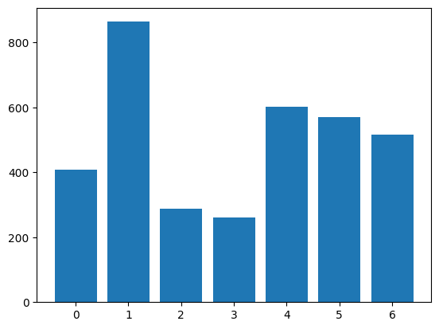
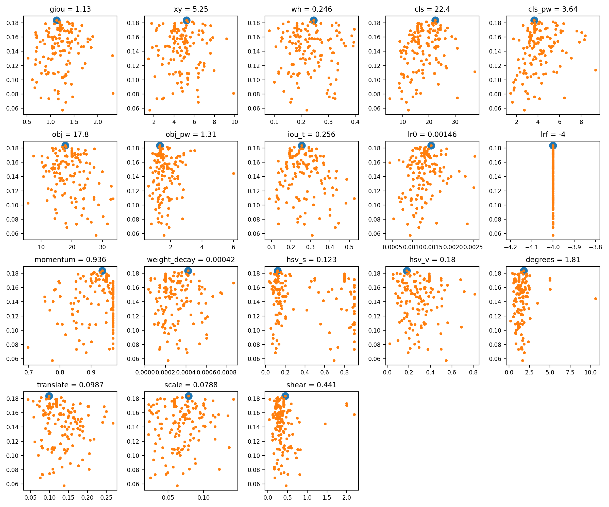
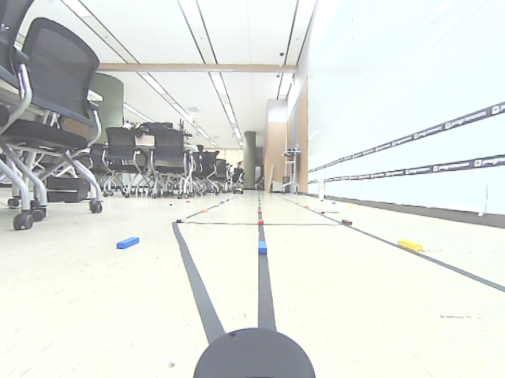
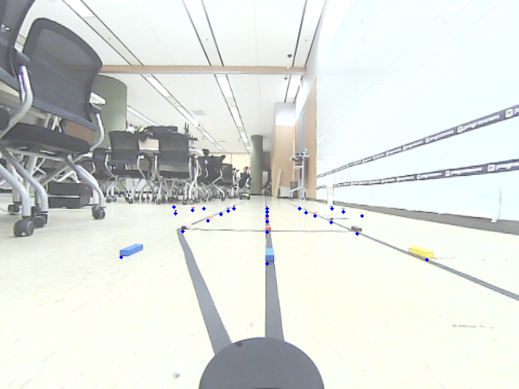
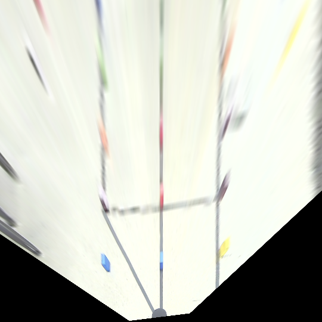
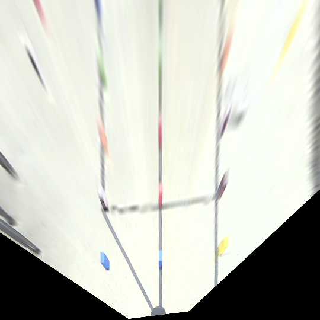
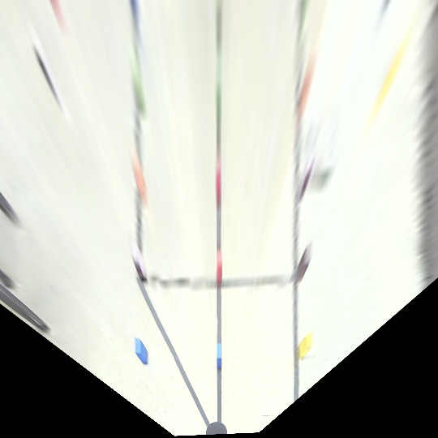
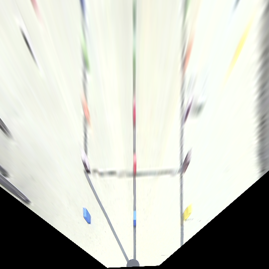
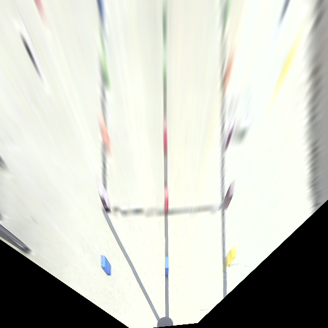
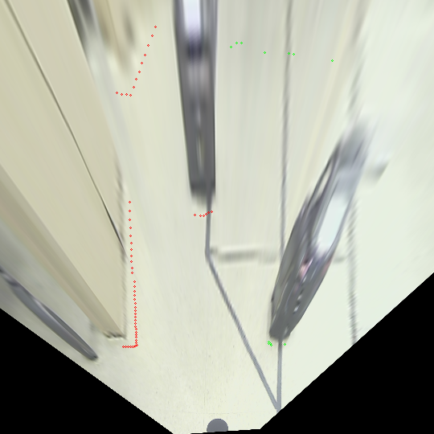

# [6팀] 삼대장

## Team Introduction

- 박지혜
- 이찬우
- 김재진

## Object Detection

- Dataset
    - Dataset 수집
        - Training data : 약 2000장
        - Class id : left, right, stop, crosswalk, uturn(toycar), traffic light, ignore, masking
        - Labeling tool : [https://www.cvat.ai/](https://www.cvat.ai/)
            
            
            
    - Active Learning
        - Non-labeling data 가 많았기 때문에, 일부 수동 labeling을 진행
        - 수동 labeling 된 데이터로 모델을 학습한 후, auto labeling 진행
    - Random Pixel Masking
        - 보통 Dataset 구축시 까맣거나 회색의 박스로 마스킹함
        - 원본 이미지에 없던 어두운 부분이 생기는 것은 모델이 잘못된 선입견을 학습할 수 있다고 판단
        - 가려야하는 부분에 무작위한 색의 픽셀값을 지정함으로 모델 파라미터가 가려진 부분때문에 업데이트 되지 않도록 함
- 객체 인식을 위한 적용 모델
    - YOLO v3. Tiny 사용
    - Input 이미지의 1/32, 1/16 해상도의 feature map을 detection에 사용
- 데이터 증강(Data Augmentation) 적용 방법
    - 활용할 수 있는 Augmentation 방법중엔 딥러닝에서 학습되는 Representation 차원이 변환되는 것과 유사한 효과를 주는 것이 대다수
    - 그런 경우 딥러닝 모델 입장에서는 동일한 sample을 여러 번 학습하는 것과 같음
    - 하나의 이미지의 다른 Representation을 학습하는 것은 parameter 개선에 유의미하지 않음
- 모델 학습을 위한 하이퍼파라미터 설정
    
    기존 cfg(yolov3-kitti416.cfg)를 사용하여 높은 epoch으로 과적합된 모델을 얻어내고자 훈련시켰으나 Training Dataset에 대한 Loss값이 원하는 수치가 나오지 않아 하이퍼 파라미터 튜닝을 결정
    
    
    
    Github issue 중 Yolov3의 Hyperparameter Evolution에 관한 그래프를 참고하여 최적화된 모델을 뽑기 위해 5가지의 cfg파일을 생성하여 학습 진행
    
    [HYPERPARAMETER EVOLUTION · Issue #392 · ultralytics/yolov3](https://github.com/ultralytics/yolov3/issues/392)
    
    |  | kitti416cfg-1 | kitti416cfg-2 | kitti416cfg-3 | kitti416cfg-4 | kitti416cfg-5 |
    | --- | --- | --- | --- | --- | --- |
    | batch | 4 | 16 | 16 | 16 | 64 |
    | learning_rate | 0.001 | 0.01 | 0.01 | 0.1 | 0.01 |
    | decay | 0.0005 | 0.0005 | 0.0001 | 0.001 | 0.0005 |
    | momentum | 0.9 | 0.936 | 0.9 | 0.936 | 0.936 |
    - 학습 과정 및 결과
        
        .png)
        
        최종적으로 kitti416cfg-2의 하이퍼 파라미터로 2000epoch의 훈련을 시킨 모델 사용
        

## Distance Estimation

- Camera Calibration
    - ROS의 camera_calibration pkg를 통해 Intrinsic, distortion matrix 계산
    
    ```python
    rosrun camera_calibration cameracheck.py
    ```
    
    - Calibration Result
        
        Intrinsic Calibration Matrix
        
        $$
           \begin{matrix} 
            0.0 & 329.91730913 &
           374.839208 \\ 0.0 & 371.474881 &
           244.814906 \\ 0.0 & 0.0 & 1.0 \\
           \end{matrix} 
        
        $$
        
        Distortion Matrix
        
        $$
        
           \begin{matrix}
        \{-0.299279& 0.067634& -0.001693& -0.002189& 0.0\}
           \end{matrix} 
        
        $$
        
- Homography Transform
    
    World, Calibration Pointing
    
    
    
    
    
    ```python
    cal_pts= np.array([
        214, 253,   # 0, 0
        251, 253,   # 0, 1
        288, 254,   # 0, 2
        328, 254,   # 0, 3
        368, 255,   # 0, 4
        408, 254,   # 0, 5
        237, 256,   # 1, 1
        281, 257,   # 1, 2
        327, 259,   # 1, 3
        377, 258,   # 1, 4
        423, 258,   # 1, 5
        216, 260,   # 2, 1
        272, 262,   # 2, 2
        328, 262,   # 2, 3
        389, 263,   # 2, 4
        445, 263,   # 2, 5
        256, 269,   # 3, 2
        328, 270,   # 3, 3
        408, 270,   # 3, 4
        225, 281,   # 4, 2
        329, 286,   # 4, 3
        441, 284,   # 4, 4
        148, 315,   # 5, 2
        329, 320,   # 5, 3
        526, 318,   # 5, 4
        239, 464    # LiDAR
    ], dtype=float)
    cal_pts = point_src.reshape(26, 2)
    ```
    
    ```python
    world_pts = np.array([
        0, 0,
        90, 0,
        180, 0,
        270, 0,
        360, 0,
        450, 0,
        90, 90,
        180, 90,
        270, 90,
        360, 90,
        450, 90,
        90, 180,
        180, 180,
        270, 180,
        360, 180,
        450, 180,
        180, 270,
        270, 270,
        360, 270,
        180, 360,
        270, 360,
        360, 360,
        180, 450,
        270, 450,
        360, 450,
        270, 540
    ], dtype=float)
    world_pts = point_dst.reshape(26, 2)
    ```
    
    RHO-LINEAR
    
    
    
    RHO-CUBIC
    
    
    
    RANSAC-LINEAR
    
    
    
    RANSAC-CUBIC
    
    
    
    LMEDS-LINEAR
    
    
    
    LMEDS-CUBIC
    
    
    
    - Result
        - 최종적으로 RANSAC을 pts의 임계값을 높여 사용하였음
- Show Lidar Points in Homography transform image
    
    Lidar 정보를 Xycar 정면 기준 좌, 우 60deg를 받아 해당 Range값을 Homography transform image에 Pointing
    
    
    
- Lidar Points Clustering
    - LiDAR의 정보가 Bounding Box의 4개 정보보다 Dense하기 때문에 LiDAR로 객체를 인식한 points를 clustering(DBSCAN) 하고 center point를 반환 → 객체의 BEV 상의 좌표
- Distance estimation with cluster center and detection result
    - BEV 상의 좌표를 Img 좌표 평면으로 역-투시변환
    - 객체의 Img 좌표 평면에서의 위치가 객체 인식의 결과 Bounding Box의 Range안에 포함되는 지 확인
    - In Range==True, 객체 인식된 category를 객체의 BEV 상의 위치에 Assign
    - In Range==False, 학습되지 않은 객체로 자이카라고 가정, 객체의 BEV 상의 위치에 자이카 Assign
    - BEV 상의 객체 위치와 자이카의 위치(라이다 위치=(W/2, H)) 사이의 거리를 픽셀 단위로 계산
    - 픽셀 단위의 유클리드 거리를 LiDAR calibration 정보를 이용해 실제 거리로 변환

## Lesson Learned

- 차선은 딥러닝으로 학습시킬 수 없었기 때문에, 룰베이스로 인식시켰음
    - 예외적인 상황이 많기 때문에 차선 인식이 불안정함
    - 예외 상황을 처리하기 위해 새로운 룰 지정시 다른 예외가 생기거나 룰이 복잡해짐
    - 따라서, 선형적인 알고리즘으로 실제 상황에서의 주행은 불가능에 가까움
- 보통의 딥러닝의 경우, Variance와 Bias가 동시에 적절한 모델을 좋은 모델로 취급
    - 이번 객체 인식-거리 추정 프로젝트의 경우 Variance가 높고 Bias가 낮은 Overfitted Model이 더 적절함
    - 실무에 딥러닝이 적용되는 상황이 이번 프로젝트와 같이 제한적이고 가변성이 적다면 Overfitting을 외려 건설적으로 활용할 수 있음
- Sensor Fusion의 경우 모든 sensor가 내재적으로 가지는 오차가 Fusion 과정에 심화됨
    - 객체의 LiDAR points를 DBSCAN을 통해 Clustering하면서 자체적으로 De-Noising되는 효과가 있었음
    - BEV 상의 객체 center-point를 이미지 평면으로 역-투시 변환후 Bounding Box Range내에 있는 지 확인하는 단순한 작업도 정확도가 많이 낮아짐
    - 오차1 + 오차2 의 선형적인 덧셈이 아닌 지수적으로 증가하는 것으로 예상
- LiDAR range 정보를 subscribe 하는 방식을 정확하게 이해하지 못하고 있음
    - Subscribe Callback 함수에서 LiDAR data를 멤버 변수로 지정했지만, 해당 데이터에 접근을 2번 할 경우 동적 할당에서 오류가 생김
    - Subscriber Pointer가 ScanCallback함수를 호출하는 위치의 수정이 필요할 것으로 예상
    - Package로 제공되는 ROS 네트워크, 통신, 프로세스 순서등에 대한 이해가 부족함을 깨달음
- 인지된 정보를 이용해 제어 흐름을 결정하는 것의 어려움
    - 여기서 인지된 정보는 카메라 영상과 같은 Raw Data가 아닌 이진화된 영상과 같이 처리된 정보를 의미함
    - 인지된 정보가 어떤 의미인지, 발생할 상황에서 어떤 정보가 얻어질 지 예측이 불가함
    - 처리된 정보에 기반해 제어 결정을 내리는 것에 문맥 정보가 풍부하게 활용되어야 정확한 결정이 내려진다는 것을 깨달음
- 코드상의 Syntax Error나 Logical Error가 없더라도 Runtime Error가 발생하는 상황을 여러번 겪음
    - 상황 1. github에서 복붙한 .yaml 파일이 파싱이 안되서 우분투 노트북에서 동일한 내용을 타입했더니 해결됨
    - 상황 2. LiDAR 데이터에 접근이 2 번 이상 불가함
    - 상황 3. 모터 접속 불량으로 ROS package 실행이 안되는데 오류 로그가 찍히지 않아서 원인 확인에 3시간 이상이 소요됨
    - 프로그램의 동작을 정확하게 알고 사용하는 것이 아니기 때문에 문제 상황에서 해결하는 것이 어려웠음